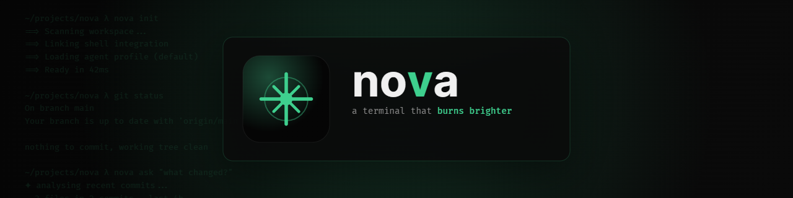

<div align="center">



</div>

## ✨ Features

- **Multi-tab workflow:** Open, close, and switch between terminal tabs without leaving the window.
- **ANSI & VTE support:** Full escape code processing via `vte` for accurate rendering of colors, cursor movement, and control sequences.
- **Built-in font:** Ships with Fira Code Nerd Font — no system font installation required.
- **AI Agentic Features:** Integrated LLM capabilities directly within the terminal, including "Ask AI" for natural language command generation and automated explanations for complex command outputs.

## 🚀 Installation

### Homebrew

| Platform | File |
|----------|------|
| macOS | `brew install --cask pmqueiroz/tap/nova` |
| Linux | `brew install pmqueiroz/tap/nova` |

### Download a release

| Platform | Download |
|----------|----------|
| Windows x86_64 | [`.exe` installer](https://github.com/pmqueiroz/nova/releases/download/v0.11.0/nova_0.11.0_x64-setup.exe) |
| macOS x86_64 | [`.dmg` disk image](https://github.com/pmqueiroz/nova/releases/download/v0.11.0/nova_0.11.0_x64.dmg) |
| macOS Apple Silicon | [`.dmg` disk image](https://github.com/pmqueiroz/nova/releases/download/v0.11.0/nova_0.11.0_aarch64.dmg) |
| Linux x86_64 | [`.deb` package](https://github.com/pmqueiroz/nova/releases/download/v0.11.0/nova_0.11.0_amd64.deb) · [`.AppImage`](https://github.com/pmqueiroz/nova/releases/download/v0.11.0/nova_0.11.0_x86_64.AppImage) |

Each release includes a [`checksums.txt`](https://github.com/pmqueiroz/nova/releases/download/v0.11.0/checksums.txt) for verifying the download.

> [!WARNING]
> Nova is not notarized — macOS may block it with *"Nova is damaged and can't be opened."*
> Run this once after installing:
> ```sh
> xattr -cr /Applications/Nova.app
> ```

> [!TIP]
> If you'd like to see Nova become a signed and notarized app, consider [sponsoring the project](https://github.com/sponsors/pmqueiroz). ❤️

### Build from source

You'll need [Rust](https://rustup.rs/) (stable, 2024 edition).

```sh
git clone https://github.com/pmqueiroz/nova.git
cd nova
cargo build --release
```

The binary will be at `./target/release/nova`. Move it into your `$PATH`:

```sh
cp ./target/release/nova ~/.local/bin/
```
